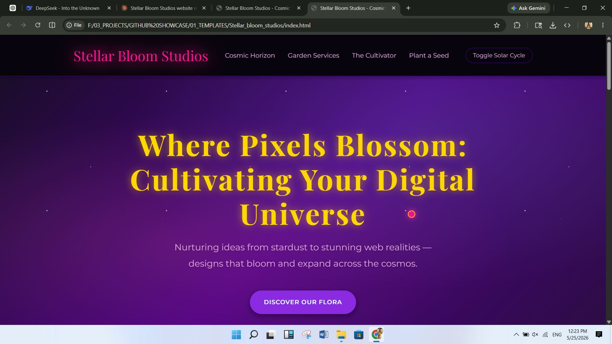
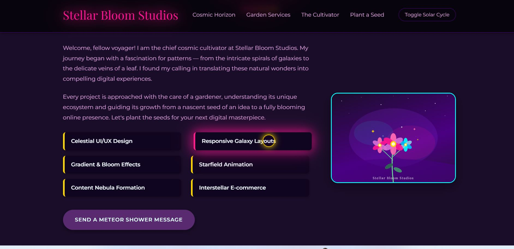
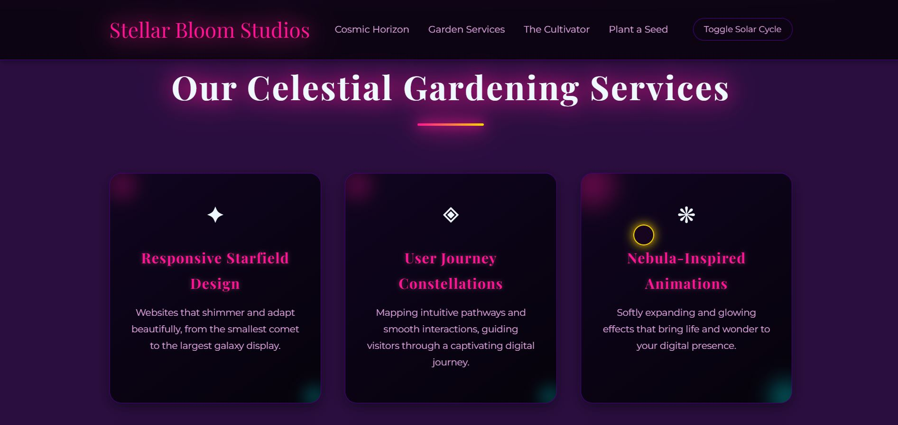
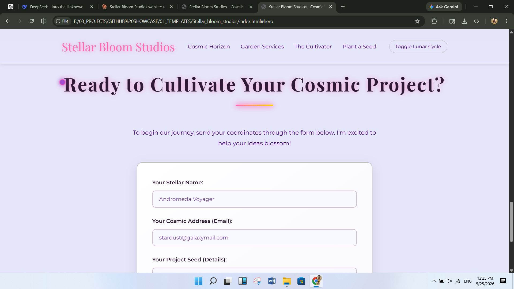

<div align="center">

# 🌸 Stellar Bloom Studios

### Cosmic Web Cultivator
*A Beautiful, Modern, and Responsive Web Experience*

[](https://developer.mozilla.org/en-US/docs/Web/Guide/HTML/HTML5)
[](https://developer.mozilla.org/en-US/docs/Web/CSS)
[](https://www.javascript.com/)
[](https://en.wikipedia.org/wiki/Responsive_web_design)
[](LICENSE)
[]()

</div>

---

## 📋 Table of Contents

- [About](#about)
- [✨ Features](#-features)
- [🎨 Screenshots](#-screenshots)
- [🛠️ Tech Stack](#️-tech-stack)
- [🚀 Installation](#-installation)
- [💻 Usage](#-usage)
- [📁 Folder Structure](#-folder-structure)
- [🌟 Live Demo](#-live-demo)
- [🔮 Future Improvements](#-future-improvements)
- [🤝 Contributing](#-contributing)
- [📄 License](#-license)
- [👤 Author](#-author)

---

## About

**Stellar Bloom Studios** is a modern, fully responsive web template that combines cosmic aesthetics with botanical elegance. Built with vanilla HTML5, CSS3, and JavaScript, this project showcases advanced web design techniques including theme switching, smooth animations, and professional UI/UX patterns.

Perfect for creative agencies, studios, or portfolio websites, Stellar Bloom Studios delivers a premium, polished web experience across all devices.

---

## ✨ Features

- 🌗 **Theme Switching** - Seamless day/night mode toggle with persistent user preference
- 📱 **Fully Responsive** - Mobile-first design that adapts beautifully to all screen sizes
- ⚡ **High Performance** - Optimized loading with custom preloader and lazy loading
- 🎨 **Modern Design** - Gradient backgrounds, smooth animations, and celestial color palette
- ♿ **Accessibility First** - WCAG compliant with skip links and ARIA labels
- 🖱️ **Custom Cursor** - Elegant custom cursor interaction
- 🎭 **Multiple Sections** - Hero, Services, About, and Contact sections fully functional
- 🔤 **Professional Typography** - Google Fonts (Montserrat & Playfair Display)
- 💾 **No Dependencies** - Vanilla JavaScript, no frameworks required
- 🎪 **Bloom Preloader** - Animated preloader with custom bloom effect

---

## 🎨 Screenshots

### Home Page - Hero Section

*The welcoming hero section with stunning cosmic gradient and call-to-action buttons*

### Navigation Bar

*Clean, modern navigation with responsive hamburger menu*

### Featured Services

*Showcase of beautiful service cards with hover animations*

### About Section

*Professional about section with elegant typography*

### Contact Section

*Intuitive contact form with validation and theme support*

---

## 🛠️ Tech Stack

| Technology | Purpose | Version |
|-----------|---------|---------|
| **HTML5** | Semantic markup & structure | 5 |
| **CSS3** | Styling, animations & themes | 3 |
| **JavaScript** | Interactivity & dynamic behavior | ES6+ |
| **Google Fonts** | Professional typography | - |
| **Responsive CSS** | Mobile-first design | - |

### Key Technologies Used:
- CSS Custom Properties (Variables) for theming
- CSS Grid & Flexbox for layouts
- CSS Animations & Transitions
- LocalStorage for persistent preferences
- DOM manipulation with vanilla JavaScript
- Mobile-first responsive design approach

---

## 🚀 Installation

### Prerequisites
- A modern web browser (Chrome, Firefox, Safari, Edge)
- A code editor (VS Code recommended)
- Basic understanding of HTML/CSS/JavaScript

### Steps

1. **Clone the repository**
   ```bash
   git clone https://github.com/yourusername/stellar-bloom-studios.git
   cd stellar-bloom-studios
   ```

2. **Open the project**
   ```bash
   # Using VS Code
   code .
   
   # Or simply open index.html in your browser
   ```

3. **Start local development server** (optional)
   ```bash
   # Using Python 3
   python -m http.server 8000
   
   # Using Python 2
   python -m SimpleHTTPServer 8000
   
   # Using Node.js (http-server)
   npx http-server
   ```

4. **Visit your local instance**
   ```
   http://localhost:8000
   ```

---

## 💻 Usage

### Basic Navigation
- Click the **Stellar Bloom Studios** logo to return to the hero section
- Use the navigation menu to jump between sections
- On mobile, use the hamburger menu for navigation

### Theme Switching
- Click the **theme toggle button** (usually in header or footer) to switch between day and night modes
- Your preference is automatically saved in browser storage

### Interacting with Components
- Hover over buttons for smooth animations
- Fill out the contact form to test validation
- Explore the responsive design by resizing your browser

### Customization
```javascript
// To modify theme colors, edit the CSS variables in style.css:
body[data-theme="day"] {
    --bg-primary: #D8BFD8;
    --text-primary: #301934;
    /* ... more variables */
}
```

---

## 📁 Folder Structure

```
stellar-bloom-studios/
│
├── 📄 index.html           # Main HTML file with all sections
├── 🎨 style.css            # Primary styles & theme definitions
├── 📱 responsive.css       # Mobile-first responsive design rules
├── ⚙️ script.js            # JavaScript functionality & interactivity
├── 📸 screenshots/         # Project screenshots for documentation
│   ├── home_page.JPG
│   ├── navbar.JPG
│   ├── our_features.JPG
│   ├── about.JPG
│   └── contact_page.JPG
└── 📖 README.md           # Project documentation (this file)
```

### File Descriptions

| File | Purpose |
|------|---------|
| `index.html` | Semantic HTML structure with all page sections |
| `style.css` | Theme variables, animations, and core styling |
| `responsive.css` | Mobile breakpoints and responsive adjustments |
| `script.js` | DOM interactions, theme switching, and functionality |
| `screenshots/` | High-quality project screenshots |

---

## 🌟 Live Demo

Check out the live version: **[Coming Soon - Deploy to GitHub Pages]**

*(To deploy your own version)*:
1. Push your code to GitHub
2. Go to Settings → Pages
3. Select "Deploy from a branch"
4. Choose `main` branch and `/ (root)` folder
5. Your site will be live at `https://yourusername.github.io/stellar-bloom-studios`

---

## 🤝 Contributing

We welcome contributions! Here's how you can help:

1. **Fork the repository**
   ```bash
   git clone https://github.com/yourusername/stellar-bloom-studios.git
   ```

2. **Create a feature branch**
   ```bash
   git checkout -b feature/amazing-feature
   ```

3. **Make your changes** and commit
   ```bash
   git add .
   git commit -m "Add some amazing feature"
   ```

4. **Push to the branch**
   ```bash
   git push origin feature/amazing-feature
   ```

5. **Open a Pull Request** on GitHub

### Guidelines
- Keep code clean and well-commented
- Test responsiveness on multiple devices
- Ensure accessibility compliance (WCAG 2.1 AA)
- Follow the existing code style

---

## 🔮 Future Improvements

- [ ] Add smooth scroll behavior for navigation links
- [ ] Implement form submission with backend integration
- [ ] Add more animation transitions between sections
- [ ] Create a component library for reusability
- [ ] Add dark mode improvements and more theme options
- [ ] Implement service worker for offline support
- [ ] Add SEO optimization and meta tags
- [ ] Create a blog section with article templates
- [ ] Add carousel/slider for testimonials
- [ ] Performance optimization and Core Web Vitals improvements
- [ ] Add parallax scrolling effects
- [ ] Implement analytics tracking

---

## 📄 License

This project is licensed under the **MIT License** - see the [LICENSE](LICENSE) file for details.

You are free to:
- ✅ Use this project for personal and commercial purposes
- ✅ Modify and distribute the code
- ✅ Include it in your portfolio

Simply include a copy of the license and give credit to the original author.

---

## 👤 Author

**Your Name / Studio Name**

- 🐙 GitHub: [@yourprofile](https://github.com/affan675)
- 📧 Email: your.affanadil119@gmail.com

---

<div align="center">

### ⭐ If you find this project helpful, please consider giving it a star!

**Built with 💜 and cosmic vibes**

[Back to Top](#-stellar-bloom-studios)

</div>